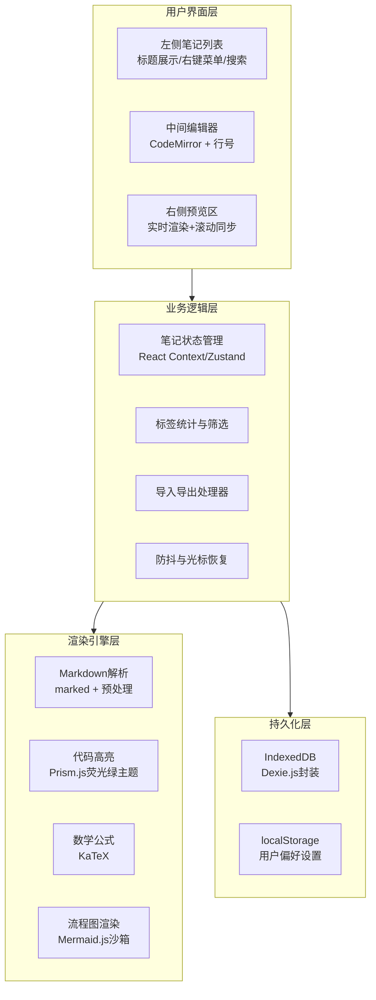
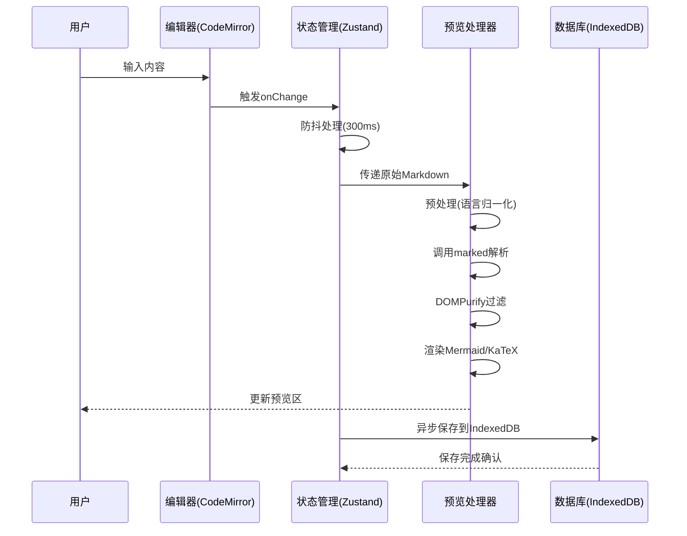

# 极客风格 Markdown 笔记编辑器 - 技术方案文档

## 1. 技术栈概览

| 技术领域     | 技术选型                            | 主要职责                     |
| ------------ | ----------------------------------- | ---------------------------- |
| 前端框架     | **React 18 + TypeScript**     | 构建UI组件、状态管理         |
| 构建工具     | **Vite**                      | 快速开发、生产构建优化       |
| Markdown解析 | **react-markdown+ DOMPurify** | 解析MD为HTML，防御XSS攻击    |
| 代码高亮     | **Prism.js**                  | 荧光绿配色的代码语法高亮     |
| 数学公式     | **KaTeX**                     | LaTeX数学公式渲染            |
| 流程图支持   | **Mermaid.js**                | 流程图、时序图、甘特图等     |
| 编辑器核心   | **CodeMirror 6**              | 支持行号、光标控制、语法提示 |
| 本地存储     | **Dexie.js (IndexedDB封装)**  | 存储笔记、标签、配置         |
| 右键菜单     | **自定义React组件**           | 极客风格、无圆角、终端感     |
| PDF导出      | **html2canvas + jspdf**       | 将预览区DOM转为PDF下载       |
| 样式方案     | **TailwindCSS + 自定义主题**  | 极客风深色主题、荧光绿高亮   |
| 响应式       | **CSS Grid + Flexbox**        | 三栏布局、移动端堆叠         |

## 2. 架构设计

### 2.1 整体架构图



### 2.2 数据流设计



## 3. 核心功能实现方案

### 3.1 左侧笔记列表

**技术要点**：

- 列表项使用虚拟滚动（如 `react-window`）优化长列表性能
- 右键菜单完全自定义，符合极客风格（硬边框、等宽字体）
- 搜索实现实时全文过滤，使用 IndexedDB 的全文索引能力

**标签管理实现**：

```typescript
// 标签统计逻辑
interface Note {
  id: string;
  title: string;
  content: string;
  tags: string[]; // 从内容中提取或用户指定
  createdAt: Date;
  updatedAt: Date;
}

// 自动统计所有笔记中的标签
const getAllTags = (notes: Note[]): Map<string, number> => {
  const tagMap = new Map();
  notes.forEach(note => {
    note.tags.forEach(tag => {
      tagMap.set(tag, (tagMap.get(tag) || 0) + 1);
    });
  });
  return tagMap;
};
```

### 3.2 Markdown 编辑器实现

**编辑器选择**：CodeMirror 6 相比 Monaco Editor 更轻量，且对移动端支持更好。支持：

- 显示行号（开箱即用）
- 光标位置恢复机制
- 快捷键支持（Ctrl+B 等标准 Markdown 快捷键）
- 主题自定义（可以完全匹配极客风格配色）

**光标恢复关键代码**（React Hook）：

```typescript
useEffect(() => {
  if (editorRef.current) {
    const selectionStart = editorRef.current.state.selection.main.from;
    const selectionEnd = editorRef.current.state.selection.main.to;
  
    // 在内容更新后恢复光标
    requestAnimationFrame(() => {
      editorRef.current?.dispatch({
        selection: { anchor: selectionStart, head: selectionEnd }
      });
    });
  }
}, [content]);
```

### 3.3 实时预览与滚动同步

**滚动同步算法**（参考 Tauri 编辑器实现经验）：

```typescript
const handleEditorScroll = (e: React.UIEvent) => {
  const editorElement = e.currentTarget;
  const previewElement = previewRef.current;
  if (!editorElement || !previewElement) return;
  
  // 计算滚动比例
  const scrollPercentage = 
    editorElement.scrollTop / 
    (editorElement.scrollHeight - editorElement.clientHeight);
  
  // 应用到预览区
  previewElement.scrollTop = 
    scrollPercentage * 
    (previewElement.scrollHeight - previewElement.clientHeight);
};
```

**防抖优化**：

```typescript
// 使用 lodash 的 debounce，300ms 延迟
const debouncedParse = useMemo(
  () => debounce((text: string) => {
    parseMarkdown(text);
  }, 300),
  []
);

const handleEditorChange = (value: string) => {
  setContent(value);
  debouncedParse(value); // 防抖处理预览更新
};
```

### 3.4 Markdown 扩展语法支持

**预处理流程**（借鉴 CrabPad 的经验）：

```typescript
const preprocessMarkdown = (text: string): string => {
  let processed = text;
  
  // 1. 代码块语言标识归一化
  processed = processed.replace(
    /```([ \t]*)(\w*)/g, 
    (match, space, lang) => {
      const normalizedLang = normalizeLanguage(lang);
      return `\`\`\`${normalizedLang}`;
    }
  );
  
  // 2. 数学公式处理（KaTeX 语法）
  // 保持原始语法，由 KaTeX 插件处理
  
  // 3. 流程图处理（Mermaid 语法）
  // 保持原始语法，由 Mermaid 处理
  
  return processed;
};
```

**安全处理**：

```typescript
import DOMPurify from 'dompurify';
import { marked } from 'marked';

const renderMarkdown = (text: string) => {
  // 先解析为 HTML
  const rawHtml = marked.parse(preprocessMarkdown(text));
  
  // 再使用 DOMPurify 过滤 XSS 攻击
  const cleanHtml = DOMPurify.sanitize(rawHtml, {
    ALLOWED_TAGS: [
      'p', 'br', 'strong', 'em', 'u', 'del', 'code', 'pre', 
      'blockquote', 'h1', 'h2', 'h3', 'h4', 'h5', 'h6',
      'ul', 'ol', 'li', 'a', 'img', 'table', 'thead', 'tbody',
      'tr', 'th', 'td', 'span', 'div', 'hr'
    ],
    ALLOWED_ATTR: ['href', 'src', 'alt', 'title', 'class', 'id']
  });
  
  return cleanHtml;
};
```

### 3.5 数据持久化方案

**为什么选择 IndexedDB 而非 localStorage**：

| 对比维度 | localStorage | IndexedDB   | 本项目选择理由         |
| -------- | ------------ | ----------- | ---------------------- |
| 容量限制 | 5-10MB       | 50MB~数百MB | 笔记可能包含大量文本   |
| 操作类型 | 同步阻塞     | 异步非阻塞  | 避免长文保存时阻塞UI   |
| 数据结构 | 仅字符串     | 任意JS对象  | 直接存储笔记对象       |
| 查询能力 | 无           | 支持索引    | 支持全文搜索和标签筛选 |
| XSS风险  | 明文存储     | 相对更安全  | 增强安全性             |

**使用 Dexie.js 简化操作**：

```typescript
import Dexie from 'dexie';

class NotesDatabase extends Dexie {
  notes: Dexie.Table<Note, string>;
  
  constructor() {
    super('GeekNotesDB');
    this.version(1).stores({
      notes: 'id, title, tags, createdAt, updatedAt, *content' // *content 表示全文索引
    });
    this.notes = this.table('notes');
  }
  
  // 创建笔记
  async createNote(note: Omit<Note, 'id' | 'createdAt' | 'updatedAt'>) {
    const id = generateId();
    const now = new Date();
    await this.notes.add({
      ...note,
      id,
      createdAt: now,
      updatedAt: now
    });
    return id;
  }
  
  // 全文搜索
  async searchNotes(keyword: string) {
    return this.notes
      .filter(note => 
        note.title.includes(keyword) || 
        note.content.includes(keyword)
      )
      .toArray();
  }
  
  // 按标签筛选
  async getNotesByTag(tag: string) {
    return this.notes
      .where('tags')
      .equals(tag)
      .toArray();
  }
}
```

### 3.6 导入导出功能实现

**PDF 导出实现**（基于 html2canvas + jspdf）：

```typescript
import html2canvas from 'html2canvas';
import jsPDF from 'jspdf';

const exportToPDF = async (element: HTMLElement, fileName: string) => {
  if (!element) return;
  
  // 解决滚动截断问题
  const originalHeight = element.scrollHeight;
  const originalStyle = element.style.height;
  element.style.height = 'auto';
  
  try {
    // 2倍缩放保证清晰度
    const canvas = await html2canvas(element, {
      scale: 2,
      useCORS: true,
      windowHeight: originalHeight,
      logging: false
    });
  
    const pdf = new jsPDF('p', 'mm', 'a4');
    const imgWidth = 190;
    const imgHeight = (canvas.height * imgWidth) / canvas.width;
  
    let position = 0;
    const pdfPageHeight = pdf.internal.pageSize.getHeight();
  
    // 分页处理
    pdf.addImage(canvas, 'PNG', 10, 10 - position, imgWidth, imgHeight);
    position += pdfPageHeight;
  
    while (position < imgHeight) {
      pdf.addPage();
      pdf.addImage(canvas, 'PNG', 10, 10 - position, imgWidth, imgHeight);
      position += pdfPageHeight;
    }
  
    pdf.save(`${fileName}.pdf`);
  } catch (error) {
    console.error('PDF导出失败:', error);
  } finally {
    element.style.height = originalStyle;
  }
};
```

**HTML 导出**：直接使用预览区渲染后的 DOM 结构，样式内联或附加 CSS。

**Markdown 导出**：直接导出原始 `.md` 文件。

**聚合导出**：将三种格式打包为 ZIP 文件（使用 JSZip 库）。

**拖拽导入**：

```typescript
const handleDrop = useCallback((e: React.DragEvent) => {
  e.preventDefault();
  const files = Array.from(e.dataTransfer.files);
  
  files.forEach(file => {
    if (file.name.endsWith('.md')) {
      const reader = new FileReader();
      reader.onload = async (event) => {
        const title = file.name.replace(/\.md$/, '');
        const content = event.target?.result as string;
      
        // 自动提取标签（支持 #tag 语法）
        const tags = extractTags(content);
      
        await db.createNote({
          title,
          content,
          tags
        });
      };
      reader.readAsText(file);
    }
  });
}, []);
```

### 3.7 响应式布局实现

**三栏布局 CSS Grid**：

```css
.app-container {
  display: grid;
  grid-template-columns: 250px 1fr 1fr; /* 左:250px, 中:1fr, 右:1fr */
  height: 100vh;
  background: #0a0a0a; /* 终端黑 */
  color: #c0c0c0; /* 银灰色 */
  font-family: 'Fira Code', 'Monaco', monospace;
}

/* 移动端：单列堆叠 */
@media (max-width: 768px) {
  .app-container {
    grid-template-columns: 1fr;
    grid-template-rows: auto 1fr 1fr;
  }
  
  /* 可切换当前显示哪个面板 */
  .sidebar.active { display: block; }
  .editor.active { display: block; }
  .preview.active { display: block; }
}

/* 极客风格细节 */
.panel {
  border: 1px solid #333; /* 硬边框，无圆角 */
  overflow: auto;
}

/* 荧光绿高亮 */
.code-highlight {
  color: #39ff14;
}
```

**移动端交互优化**：

- 使用触摸事件 (`touchend`) 替代点击事件，减少 300ms 延迟
- 编辑器在移动端自动放大字体到 16px 避免缩放
- 提供底部导航栏切换三个面板

## 4. 性能优化策略

### 4.1 渲染性能

| 优化点       | 策略                     | 预期效果         |
| ------------ | ------------------------ | ---------------- |
| 编辑器输入   | 300ms 防抖 + 光标恢复    | 流畅输入不卡顿   |
| 预览更新     | 增量渲染，只更新变化部分 | 长文档快速响应   |
| 代码高亮     | 懒加载语法文件           | 减少首屏加载时间 |
| Mermaid 渲染 | Web Worker 隔离          | 不阻塞主线程     |
| 笔记列表     | 虚拟滚动                 | 千条笔记流畅滚动 |

### 4.2 存储性能

IndexedDB 操作优化建议：

- 使用游标 (`cursor`) 遍历而非 `getAll()` 处理大量数据
- 批量写入时使用事务
- 为常用查询字段建立索引（标题、标签、更新时间）

## 5. 安全考虑

### 5.1 XSS 防御

多层防护机制：

1. **输入层**：DOMPurify 过滤，配置严格的白名单
2. **渲染层**：使用 iframe 沙箱隔离 Mermaid 渲染
3. **存储层**：数据在存储时不做额外处理，保持原样

### 5.2 内容安全策略 (CSP)

```html
<meta http-equiv="Content-Security-Policy" content="
  default-src 'self';
  script-src 'self' 'unsafe-inline' 'unsafe-eval';
  style-src 'self' 'unsafe-inline';
  img-src 'self' data: https:;
  connect-src 'none';
">
```

## 6. 开发与构建

### 6.1 项目结构

```
src/
├── components/
│   ├── Sidebar/          # 左侧笔记列表
│   │   ├── NoteList.tsx
│   │   ├── NoteItem.tsx
│   │   ├── ContextMenu.tsx  # 自定义右键菜单
│   │   └── TagFilter.tsx
│   ├── Editor/
│   │   ├── CodeMirrorEditor.tsx
│   │   └── EditorToolbar.tsx
│   ├── Preview/
│   │   ├── PreviewPane.tsx
│   │   ├── MarkdownRenderer.tsx
│   │   └── ScrollSync.tsx
│   └── Common/
│       ├── ExportButtons.tsx
│       └── LoadingSpinner.tsx
├── hooks/
│   ├── useDebounce.ts     # 防抖
│   ├── useIndexedDB.ts    # Dexie封装
│   ├── useExportPDF.ts    # PDF导出
│   └── useScrollSync.ts   # 滚动同步
├── lib/
│   ├── markdown/
│   │   ├── preprocess.ts  # 预处理
│   │   ├── plugins/       # 自定义插件
│   │   └── sanitize.ts    # DOMPurify配置
│   └── storage/
│       └── db.ts          # Dexie数据库定义
├── styles/
│   ├── geek-theme.css     # 极客风格主题
│   └── prism-geek.css     # 荧光绿代码高亮
└── App.tsx
```

### 6.2 构建配置 (Vite)

```typescript
// vite.config.ts
import { defineConfig } from 'vite';
import react from '@vitejs/plugin-react';

export default defineConfig({
  plugins: [react()],
  build: {
    target: 'es2020',
    rollupOptions: {
      output: {
        manualChunks: {
          'markdown': ['marked', 'dompurify'],
          'editor': ['@codemirror/state', '@codemirror/view'],
          'diagram': ['mermaid'],
          'math': ['katex'],
          'vendor': ['react', 'react-dom', 'dexie']
        }
      }
    }
  },
  server: {
    port: 3000
  }
});
```

## 8. 开发路线图

### Phase 1: MVP 核心功能

- [ ] 搭建 React + TypeScript + Vite 项目
- [ ] 实现三栏布局（左侧列表 + 中间编辑器 + 右侧预览）
- [ ] 集成 CodeMirror 6（行号、标准快捷键）
- [ ] 集成 marked + DOMPurify（基础 Markdown 渲染）
- [ ] 实现 IndexedDB 存储（Dexie.js）
- [ ] 笔记列表：展示、新建（内联输入）、删除
- [ ] 右键菜单（删除、重命名）

### Phase 2: 扩展功能

- [ ] 标签系统（提取、统计、筛选）
- [ ] 实时搜索（全文）
- [ ] 滚动同步功能
- [ ] 代码高亮（Prism.js 荧光绿主题）
- [ ] 数学公式（KaTeX）
- [ ] 流程图（Mermaid.js）
- [ ] 导出功能（Markdown/HTML）

### Phase 3: 高级功能

- [ ] PDF 导出（html2canvas + jspdf）
- [ ] 聚合导出（ZIP 打包）
- [ ] 拖拽导入
- [ ] 移动端响应式适配
- [ ] 性能优化（防抖、虚拟滚动）
- [ ] 暗色主题切换（默认极客风）
